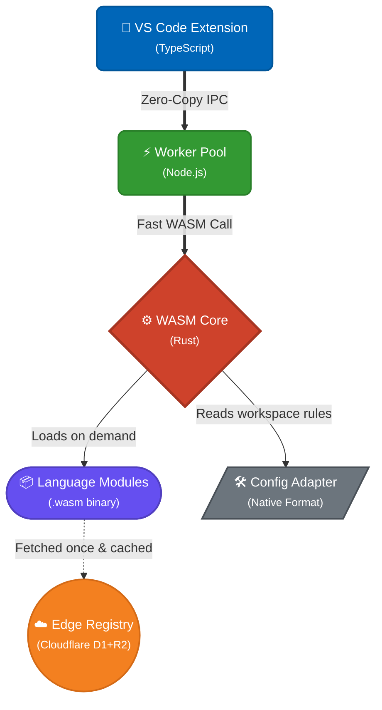

<div align="center">
  
  <br/>

# OmniFormatter

**One extension. Every language. Zero configuration.**

[](https://marketplace.visualstudio.com/items?itemName=Abdu1-Ahd.omni-formatter)
[](https://open-vsx.org/extension/Abdu1-Ahd/omni-formatter)
[](https://github.com/Abdu1-Ahd/Omni-Formatter/actions)
<br/>
[](https://www.rust-lang.org/)
[](https://webassembly.org/)
[](https://workers.cloudflare.com/)

[Install for VS Code](https://marketplace.visualstudio.com/items?itemName=Abdu1-Ahd.omni-formatter) • [Install for Open VSX](https://open-vsx.org/extension/Abdu1-Ahd/omni-formatter) • [Documentation](docs/) • [Add a Language](docs/ADD_LANGUAGE_TEMPLATE.md)

</div>

---

## 🚀 Why OmniFormatter?

Stop installing 10 different formatters (Prettier, ESLint, Black, rustfmt, clang-format, gofmt...) that constantly conflict with each other. 

**OmniFormatter eliminates the chaos.** It provides a single, blazing-fast WASM core that formats *everything* seamlessly.

<table>
  <tr>
    <td align="center">⚡<br/><b>Blazing Fast</b></td>
    <td align="center">📦<br/><b>Zero Config</b></td>
    <td align="center">🛡️<br/><b>Secure</b></td>
    <td align="center">🌍<br/><b>Universal</b></td>
  </tr>
  <tr>
    <td>WASM core activates in under 5ms with zero-copy infinite file size scaling.</td>
    <td>Automatically detects and reads native configurations (<code>.prettierrc</code>, <code>pyproject.toml</code>).</td>
    <td>Runs in a strict WASM Sandbox. All modules are cryptographically signed.</td>
    <td>Supports 70+ languages out-of-the-box via dynamic edge registry.</td>
  </tr>
</table>

---

## 🛠️ Supported Languages

OmniFormatter downloads the tiny language modules you need **on-the-fly** and caches them forever. 

* 🌐 **Frontend**: JavaScript, TypeScript, JSX, TSX, Vue, Svelte, Astro, HTML, CSS, SCSS, Sass, Less
* ⚙️ **Systems**: Rust, C, C++, Objective-C, Go, Zig, Nim, D
* ☕ **JVM & .NET**: Java, Kotlin, Scala, Groovy, C#, F#
* 🐍 **Scripting**: Python, Ruby, PHP, Perl, R, Julia, Lua
* 📱 **Mobile**: Swift, Dart
* 📝 **Markup & Data**: JSON, YAML, TOML, XML, INI, Markdown, LaTeX
* 📊 **DevOps & DB**: Dockerfile, Terraform, Nix, Makefile, SQL, GraphQL
* 🧩 **And More**: Haskell, Elixir, Erlang, OCaml, Clojure, Lisp, Scheme, Solidity, GDScript, AutoHotkey, Cobol, Fortran, Assembly, Jinja, Liquid, EJS, Handlebars, Twig...

---

## 💻 Quick Start

Set OmniFormatter as your default formatter and enable format-on-save in your `settings.json`:

```json
{
  "editor.defaultFormatter": "Abdu1-Ahd.omni-formatter",
  "editor.formatOnSave": true,
  "editor.formatOnType": true
}
```

That's it. Keep using your existing configuration files (e.g., `.prettierrc`, `rustfmt.toml`), and OmniFormatter will adapt automatically.

---

## 🏗️ Architecture



## 🤝 Contributing

Contributions are welcome! Adding a language does not require touching the core extension. See our [Language Blueprint](docs/ADD_LANGUAGE_TEMPLATE.md) for how to add a language module in 10 minutes.