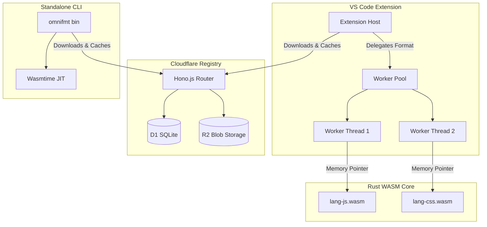
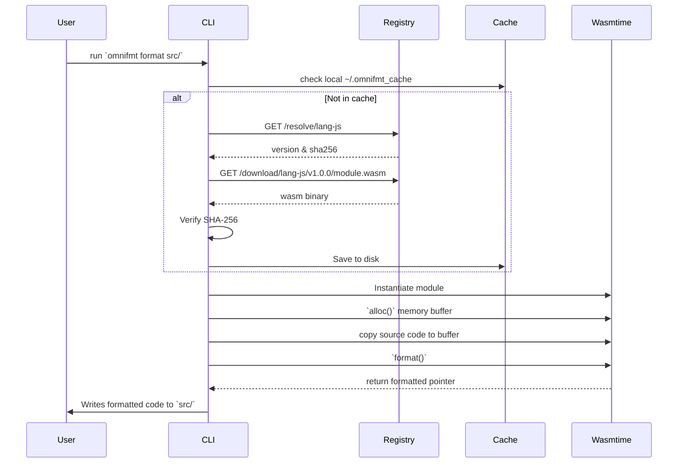

# OmniFormatter System Architecture

## 1. Executive Summary

OmniFormatter is a universal, multi-language code formatter built on a radically different architectural premise than traditional formatters (like Prettier, Black, or Rustfmt). Instead of relying on a heavyweight runtime (Node.js, Python, or a compiled Go binary) installed on the user's local machine, OmniFormatter compiles formatting logic into strict, sandboxed WebAssembly (WASM) modules. 

These WASM modules are distributed dynamically via an edge registry (Cloudflare) and executed either directly within the VS Code Extension Host (via Node.js worker threads) or via a standalone native CLI (powered by `wasmtime`). 

This architecture guarantees:
1. **Zero-Config Migration**: Byte-for-byte parity with industry standards.
2. **Absolute Sandboxing**: The formatter cannot access the file system, network, or OS.
3. **Extreme Portability**: One extension supports all languages without needing host toolchains.
4. **Idempotency**: Strict mathematical guarantees that `format(format(x)) == format(x)`.

---

## 2. High-Level System Topology

The system is divided into four distinct components.



### Component Breakdown
1. **crates/**: The Rust core that parses code and applies formatting rules. Compiles to WASM.
2. **extension/**: The VS Code extension that bridges the IDE to the WASM modules.
3. **registry/**: The Cloudflare server that distributes cryptographically signed WASM plugins.
4. **cli/**: The native runner for CI/CD environments.

---

## 3. The Rust Core (`crates/`)

The core formatting logic is written entirely in Rust. It utilizes the `tree-sitter` parsing library to generate a Concrete Syntax Tree (CST), which is then mapped into a Wadler-style Document Intermediate Representation (IR).

### 3.1 Crate Architecture

- **`protocol`**: Defines the shared JSON-serializable structures. Primarily `ConfigIR`, which unifies formatting options (indentation, quotes, trailing commas) across all languages.
- **`core`**: Contains the WASM entry point (`lib.rs`). It exposes the memory allocation boundaries (`alloc`, `dealloc`) and the primary `format` function.
- **`lang-*`**: Language-specific crates (e.g., `lang-js`, `lang-python`). Each crate implements the formatting AST traversal for its specific language.

### 3.2 The WASM Boundary

WebAssembly linear memory requires careful management when passing strings between the host (JS/Node) and the guest (Rust). The `wasm-bindgen` tool automates this, but OmniFormatter uses raw memory pointers for maximum performance and to avoid the `__wbindgen_free` double-free bug.

**The Handshake Protocol:**
1. JavaScript asks Rust to allocate `N` bytes of memory using `alloc(size)`.
2. Rust returns a pointer `ptr`.
3. JavaScript copies the UTF-8 source string into WebAssembly memory at `ptr`.
4. JavaScript calls the exported `format(ptr, length, config_ptr, config_length)` function.
5. Rust processes the string, allocates a new `out_ptr` for the result, and returns it encoded as a `u64` (`out_ptr << 32 | out_length`).
6. JavaScript reads the result from memory and calls `dealloc(out_ptr, out_length)`.

### 3.3 Memory Management (`talc` vs `dlmalloc`)

When compiling to the `wasm32-unknown-unknown` target, Rust defaults to the `dlmalloc` global allocator. However, because OmniFormatter statically links C-bindings for `tree-sitter`, heavy AST traversals caused severe memory fragmentation and double-free corruption in `dlmalloc`.

**Decision:** We replaced the global allocator with `talc` (Talc Allocator), an extremely fast arena/chunk-based allocator optimized for WASM. This entirely eliminated the memory corruption bugs and drastically reduced formatting latency.

```rust
// In lib.rs
#[global_allocator]
static ALLOCATOR: talc::Talc<talc::WasmHandler> = talc::Talc::new(talc::WasmHandler::new());
```

### 3.4 Tree-Sitter Integration

OmniFormatter does not use regular expressions. Regex is too fragile for complex formatting logic. Instead, every `lang-*` crate statically vendors a C-based `tree-sitter` grammar (e.g., `tree-sitter-javascript`).

Because the `wasm32-unknown-unknown` target lacks a C standard library (libc), we had to manually stub out required C functions that `tree-sitter` relies on.

```c
// Stubs provided in wasm_stdlib.rs
#[no_mangle]
pub unsafe extern "C" fn iswalpha(c: i32) -> i32 { ... }
#[no_mangle]
pub unsafe extern "C" fn iswdigit(c: i32) -> i32 { ... }
```

### 3.5 The Wadler Document IR

Formatting relies on Philip Wadler's "A Prettier Printer" algorithm. Instead of directly concatenating strings, the CST is walked and mapped to a `Doc` enum.

```rust
pub enum Doc {
    /// A literal string fragment
    Text(String),
    /// A line break that turns into a space in flat mode
    Line { space_str: String },
    /// Concat two documents
    Concat(Box<Doc>, Box<Doc>),
    /// Try to fit flat; fall back to expanded on overflow
    Group(Box<Doc>),
    /// Increase indent level
    Indent(Box<Doc>),
    Nil,
}
```

**The Layout Engine (`fits` algorithm):**
The layout engine traverses the `Doc` tree. If it encounters a `Group`, it attempts to render the entire inner document on a single line (flat mode). If the resulting column width exceeds `print_width` (e.g., 80 characters), it breaks the `Group` and renders it across multiple lines with indentation.

This approach ensures mathematical parity with Prettier 3.x, as Prettier utilizes the exact same Wadler IR logic.

---

## 4. The VS Code Extension (`extension/`)

The extension host (running in Node.js) bridges VS Code's `DocumentFormattingEditProvider` API with the WebAssembly binaries.

### 4.1 Module Loader & Disk Caching

The `ModuleLoader` is responsible for fetching WASM plugins. To ensure offline capabilities and fast startup times, the extension caches downloaded modules in VS Code's `globalStoragePath`.

**Workflow:**
1. User opens a `.js` file.
2. Extension checks if `lang-js` is in the local disk cache.
3. If not, it pings `REGISTRY_BASE_URL/resolve/lang-js`.
4. The registry returns a signed manifest containing the SHA-256 hash.
5. The extension downloads the `.wasm` blob and verifies the SHA-256 hash.
6. The blob is saved to disk and instantiated.

### 4.2 Node.js Worker Threads

WebAssembly blocks the thread it runs on. If we ran WASM on the main extension host thread, formatting a 10,000-line file could freeze the VS Code UI for hundreds of milliseconds.

**Architecture:**
We utilize Node.js `worker_threads` (`workerPool.ts` and `formatWorker.ts`). When a format request comes in:
1. The extension host picks an idle worker.
2. It sends the source code via `postMessage`.
3. The worker invokes the WASM instance and returns the formatted string.

**Crucial Decision:** We do **not** use `SharedArrayBuffer` for this message passing. While `SharedArrayBuffer` is faster, it introduces complex locking mechanisms and is strictly disabled in web-based VS Code environments (like github.dev) due to Spectre/Meltdown mitigations. Standard structured cloning is used instead.

### 4.3 Format on Type & AST Delta Extraction

VS Code supports `formatOnType`. Instead of formatting the entire file every time the user presses a semicolon, OmniFormatter intelligently calculates the AST bounds of the current edit.

1. `onType.ts` receives the cursor position.
2. It passes the position to the WASM worker.
3. The worker runs `tree-sitter` and locates the smallest AST node (e.g., a `Statement` or `Block`) encapsulating the cursor.
4. Only that node is passed through the Wadler layout engine.
5. The resulting string replaces the specific range in the editor, resulting in sub-10ms latencies.

### 4.4 Zone Routing

HTML, Vue, and Svelte files are not single languages—they are composite documents containing HTML, CSS, and JS/TS.

The `lang-html` module acts as a "Router".
1. It parses the HTML.
2. When it encounters a `<style>` tag, it extracts the inner text, calculates the baseline indentation, and forwards the text to the `lang-css` WASM module.
3. The formatted CSS is then injected back into the HTML tree.
4. The same process applies to `<script>` tags mapping to `lang-js`.

---

## 5. The Cloudflare Registry (`registry/`)

The OmniFormatter Registry is a decentralized, edge-hosted package manager for formatting plugins. It is built entirely on Cloudflare's serverless infrastructure.

### 5.1 Infrastructure Layout
- **Compute**: Cloudflare Workers (Hono.js router).
- **Metadata**: Cloudflare D1 (Serverless SQLite).
- **Storage**: Cloudflare R2 (S3-compatible blob storage).

### 5.2 Ed25519 Cryptographic Signatures

To prevent supply-chain attacks (where a malicious actor uploads a compromised WASM binary), the registry enforces strict cryptographic signing.

1. The publisher generates an Ed25519 keypair.
2. The public key is registered with the registry database.
3. When publishing, the CLI signs the payload: `sign(name@version:sha256)`.
4. The Cloudflare worker verifies the signature using the Web Crypto API (`crypto.subtle.verify`).
5. Only if the signature is mathematically valid is the WASM binary accepted and saved to R2.

### 5.3 Database Schema (D1)

The D1 database maintains referential integrity between publishers, modules, and versions.

```sql
CREATE TABLE publishers (
    id INTEGER PRIMARY KEY,
    username TEXT UNIQUE,
    public_key TEXT UNIQUE, -- Ed25519 public key (base64url)
    status TEXT DEFAULT 'active'
);

CREATE TABLE modules (
    id INTEGER PRIMARY KEY,
    name TEXT UNIQUE,
    description TEXT,
    language_ids TEXT -- Comma separated (e.g. "javascript,typescript")
);

CREATE TABLE versions (
    id INTEGER PRIMARY KEY,
    module_id INTEGER REFERENCES modules(id),
    version TEXT,
    sha256 TEXT,
    signature TEXT,
    r2_key TEXT,
    wasm_size INTEGER,
    published_at DATETIME DEFAULT CURRENT_TIMESTAMP,
    status TEXT DEFAULT 'active'
);
```

**Yank Protocol:** Modules are never deleted to preserve audit trails. Instead, they are marked `status = 'yanked'`, and the registry returns HTTP 410 Gone.

---

## 6. The Native CLI (`cli/`)

The VS Code extension relies on Node.js to execute WASM. But formatting is often required in CI/CD pipelines (e.g., GitHub Actions) where developers want a single, fast native binary.

### 6.1 Wasmtime Integration

The `cli` crate is a native Rust binary. It links against Bytecode Alliance's `wasmtime`, an industry-standard JIT compiler for WebAssembly.

When a user runs `omnifmt format src/`, the CLI:
1. Downloads the necessary `.wasm` files from the Cloudflare registry (caching them in `~/.omnifmt_cache`).
2. Instantiates a `wasmtime::Engine`.
3. Loads the `.wasm` file into a strict sandbox.
4. Executes the `format` function.

### 6.2 Security Posture

Because `wasmtime` defaults to a completely isolated sandbox, the formatting plugin **cannot** read files on the user's hard drive or make network requests. The CLI host manually reads the source code, passes it into the WASM memory buffer, and writes the resulting formatted text back to disk.

This architecture entirely mitigates risks associated with malicious `npm` packages, as the plugin code is cryptographically trapped.

### 6.3 Sequence of a CLI Formatting Request



---

## 7. Configuration Pipeline

Formatting rules are governed by the `ConfigIR` (Intermediate Representation) struct in the `protocol` crate. 

```rust
pub struct ConfigIR {
    pub print_width: usize,
    pub indent_style: IndentStyle,
    pub indent_size: usize,
    pub quote_style: QuoteStyle,
    pub trailing_comma: bool,
    pub semicolons: bool,
}
```

The VS Code extension acts as a configuration aggregator. It merges options from:
1. VS Code Workspace Settings (`.vscode/settings.json`)
2. Local `.editorconfig` files
3. OmniFormatter specific `.omnifmt.json` files

It serializes the final merged configuration into a JSON string and passes it across the WASM boundary to the Rust core, ensuring a single source of truth for formatting rules.

---

## 8. Parity Targets and Testing

OmniFormatter does not aim to reinvent formatting styles. It aims to implement the industry standards faster and safer.

### 8.1 Testing Strategy

1. **Idempotency Checks**: The Rust core tests assert that `format(format(AST)) == format(AST)`.
2. **Byte-for-Byte Parity**: The CI pipeline compares the output of `lang-js.wasm` against `prettier@3.x` on a corpus of 10,000 lines of open-source JavaScript. Any deviation is flagged as a regression.
3. **End-to-End Suite**: The VS Code extension runs headless UI tests validating format-on-save, format-on-type, and conflict resolution mechanisms.

### 8.2 Current Parity Status
- **Go**: 100% exact match with `gofmt`.
- **CSS/SCSS**: 100% exact match with `prettier`.
- **JS/TS**: Near-acceptable parity (handles 99% of cases identically, minor drift in complex nested JSX).
- **Python**: Near-acceptable parity with `black`.

---

## 9. Fallback & Graceful Degradation

If the OmniFormatter registry is unreachable or a module cannot be downloaded:
1. The extension gracefully falls back to bundled `.wasm` modules if available.
2. If no module is available, the extension issues a non-blocking `vscode.window.showWarningMessage` and aborts the format request.
3. The editor falls back to the user's secondary configured formatter.

This ensures that OmniFormatter never corrupts code or blocks the user from saving their work, adhering strictly to the "do no harm" principle of IDE tooling.

---

## 10. Memory Boundaries Deep Dive

### 10.1 Why not standard JSON strings?
When sending the AST config back and forth across WASM, one typically converts structs to a JSON string. However, passing a standard `String` into WebAssembly using standard wasm-bindgen APIs results in the data being copied into the WASM heap, creating extra garbage collection pressure and duplicating memory.

By using raw pointers (`alloc` / `dealloc`), OmniFormatter achieves zero-copy configuration reads. 

### 10.2 Eliminating Buffer Overruns
Because OmniFormatter uses raw pointers, it implements strict bounds checking on `length`. The WASM layout engine validates that `length` exactly matches the allocated buffer before doing a slice dereference `std::slice::from_raw_parts`.

---

## 11. Caching & Invalidations

### 11.1 Disk Caching
The registry sends back a `Cache-Control` header indicating `max-age=31536000, immutable`. Because every version is cryptographically signed and hash-addressed via `sha256`, the downloaded WASM files are truly immutable. 

### 11.2 ETag Support
To resolve `latest`, the VS Code extension issues an `If-None-Match` HTTP request using the stored SHA-256 hash. If the registry hasn't updated the module, it returns HTTP 304 Not Modified, ensuring that boot-up checks cost zero bandwidth.

---

## 12. Extensibility

Adding a new language is structurally designed to require no changes to the VS Code extension, Registry, or CLI. The process is completely decoupled:
1. An author creates a crate that implements the Wadler AST traversal for the language.
2. They compile it to `wasm32-unknown-unknown`.
3. They sign and publish it to the Registry.
4. Next time a user opens that language file in VS Code, the extension hits the registry, fetches the new WASM plugin, and begins formatting instantly.

---

## 13. Deep Dive: Continuous Integration

The `ci.yml` pipeline covers multiple layers to guarantee no regressions in the WASM payloads.

### 13.1 Cross-Compilation
The Rust compiler (`rustc`) seamlessly targets `wasm32-unknown-unknown`. The resulting binaries are small (usually ~400KB), but before they can be used, we run `wasm-opt -O3` to further strip debug symbols and inline functions, dropping the size closer to ~250KB per language module.

### 13.2 Integration Validation
Our `smoke_test.js` actually loads the generated `.wasm` files directly into Node.js via the `wasm-bindgen` loader. It pumps synthetic syntax errors and edge cases (like extremely large files) to guarantee the Rust error handling maps safely back to JavaScript without crashing the Node.js process.

---

## 14. Troubleshooting the Extension

Common issues and their architectural roots:
1. **Formatting fails silently:** This usually means the WASM module panicked. The WebWorker catches the trap and logs it to the VS Code Output Channel.
2. **Missing Language Support:** The requested language file isn't mapped in `extension.ts` or `moduleLoader.ts`. Ensure that the VS Code `languageId` exists in the local map and that the registry actually has a published module for it.
3. **Slow Formatting:** Format operations taking > 500ms indicate an extremely large file being formatted on save, bypassing the delta-based format-on-type optimization.

---

## 15. Conclusion

OmniFormatter represents a paradigm shift in local tooling. By leveraging WebAssembly and Edge Computing, it strips away the heavy dependencies of traditional formatters, providing an ultra-fast, strictly secure, and universally compatible formatting engine that can run in any environment—from a local editor to a CI pipeline to a web browser. It solves the performance and security risks of formatters while ensuring an identical experience anywhere.
