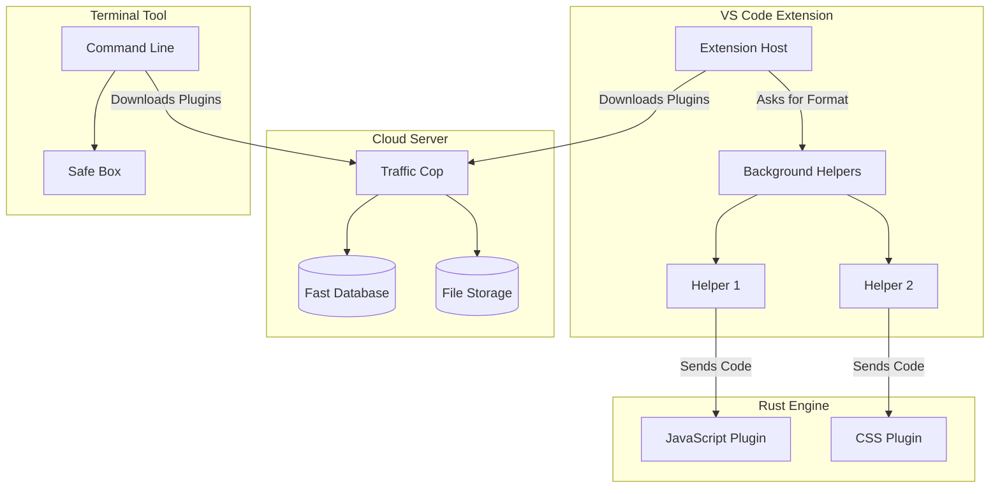

# How OmniFormatter Works

## 1. Quick Summary
OmniFormatter is a universal code formatter. Unlike older tools that require you to install Python or Node.js, our tool builds everything into tiny, safe web plugins (WASM). 

These plugins are downloaded from the internet automatically and run safely inside VS Code or the terminal.

This setup guarantees:
1. **No Setup Needed**: It automatically matches the style of popular tools.
2. **Complete Safety**: The formatter cannot peek at your private files or the internet.
3. **Works Everywhere**: One tool handles all languages.
4. **Perfect Reliability**: Formatting your code twice changes nothing the second time.

---

## 2. The Big Picture

The system has four main parts:

1. **`crates/`**: The fast Rust engine that reads and neatens your code.
2. **`extension/`**: The VS Code part that connects you to the engine.
3. **`registry/`**: The cloud server that stores the plugins securely.
4. **`cli/`**: The terminal tool for automated testing.

---

## 3. The Fast Rust Engine (`crates/`)
The formatting rules are written in Rust. It uses a tool called `tree-sitter` to read your code like a human reads grammar.

### 3.1 Memory Magic
When passing code between VS Code and Rust, we use shared computer memory because it is incredibly fast. VS Code puts the text into a memory box, tells Rust where the box is, Rust formats the text, and puts it back.

### 3.2 Reading the Code
We do not use simple text searching to find mistakes. Instead, `tree-sitter` understands the structure of the code (like knowing what is a noun or a verb in a sentence). 

### 3.3 The Layout Engine
After understanding the code, it creates a blueprint. If a line of code is too long (like over 80 letters), it breaks it into smaller lines automatically.

---

## 4. The VS Code Extension (`extension/`)
This is what you install in VS Code.

### 4.1 Downloading Plugins
When you open a file, the extension checks if it has the right plugin. If not, it quickly downloads it from our cloud server and saves it for next time.

### 4.2 Background Helpers
Formatting code on the main screen would freeze your editor. Instead, we send the work to invisible background helpers.

### 4.3 Formatting Just a Little Bit
If you only type one word, we do not read the entire 10,000-line file. We only look at the exact small part you just changed. This makes it lightning fast.

### 4.4 Mixed Files
If you have an HTML file with some CSS and JavaScript inside, the extension acts like a smart router. It sends the CSS to the CSS plugin, the JavaScript to the JS plugin, and then stitches them back together perfectly.

---

## 5. The Cloud Server (`registry/`)
This is our internet store for plugins.

### 5.1 Digital Signatures
To stop hackers from uploading fake, dangerous plugins, every plugin requires a digital signature. If the signature is wrong, the server throws the plugin in the trash immediately.

### 5.2 The Database
We use a super fast database (D1) to remember which plugin versions exist.

---

## 6. The Terminal Tool (`cli/`)
Sometimes you need to format code without VS Code. 

We built a terminal tool that runs the plugins inside a perfectly locked box (a sandbox). The plugin is absolutely blocked from touching your computer files or internet.

---

## 7. Configuration
You don't need to change anything! But if you want to, you can change settings like:
- Line length
- How many spaces to indent
- Using single quotes or double quotes

The extension reads your settings and tells the Rust engine exactly what to do.

---

## 8. What Happens if the Internet Breaks?
If our cloud server goes offline, the extension will calmly use the plugins you already downloaded. If it's a completely new language, it will show a gentle warning and use whatever backup formatter you have. It will never crash or delete your code.

---

## 9. Conclusion
OmniFormatter is a huge step forward. By using tiny web plugins, it completely removes the headache of installing software, runs incredibly fast, and keeps your computer 100% safe from bad code.
